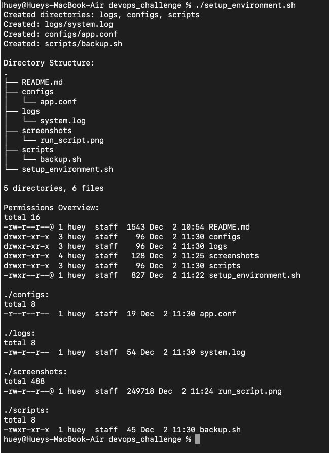

# SysAdmin Starter Pack – Automation Script

## Overview

This project contains a Bash script (`setup_environment.sh`) that automates the creation of a basic folder structure for storing logs, configuration files, and scripts.  
The script also creates sample files, sets permissions, and displays the final directory layout.

---

## Tasks Performed by the Script

1. Creates directories:

   - `logs/`
   - `configs/`
   - `scripts/`

2. Creates files:

   - `logs/system.log`
   - `configs/app.conf`
   - `scripts/backup.sh`

3. Adds sample content to the files.

4. Sets permissions:

   - `logs/system.log` → `rw-r--r--` (644)
   - `configs/app.conf` → `r--r--r--` (444)
   - `scripts/backup.sh` → `rwxr-xr-x` (755)

5. Displays directory structure using `tree` (or fallback method).

6. Displays all permissions using `ls -lR`.

---

## How to Run the Script

### 1. Create and enter working directory

```bash
mkdir ~/devops_challenge && cd ~/devops_challenge
```

### 2. Create the script file

```bash
vim setup_environment.sh
```

### 3. Make script executable

```bash
chmod u+x setup_environment.sh
```

### 4. Run the script

```bash
./setup_environment.sh
```

### Expected Output Structure

```bash
.
├── README.md
├── configs
│   └── app.conf
├── logs
│   └── system.log
├── screenshots
│   └── run_script.png
├── scripts
│   └── backup.sh
└── setup_environment.sh
```

#### Example File Permissions

```bash

-rw-r--r-- logs/system.log
-r--r--r-- configs/app.conf
-rwxr-xr-x scripts/backup.sh

```

### Tree Command Not Found

```bash
# Ubuntu/Debian
sudo apt-get install tree

# CentOS/RHEL
sudo yum install tree

# macOS
brew install tree

```

## Screenshot of Script Execution


